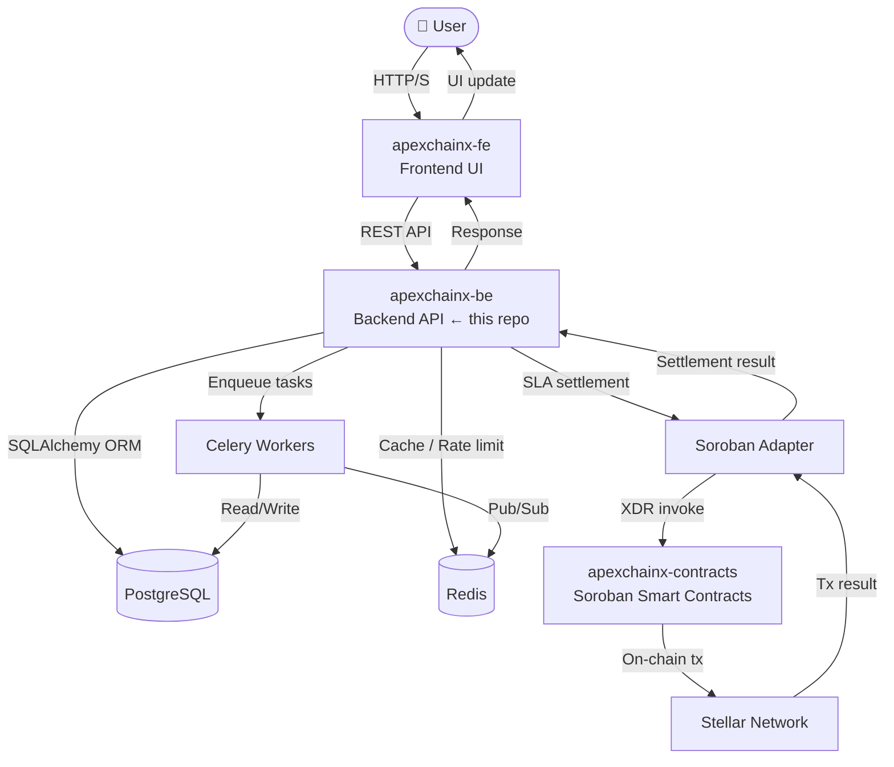
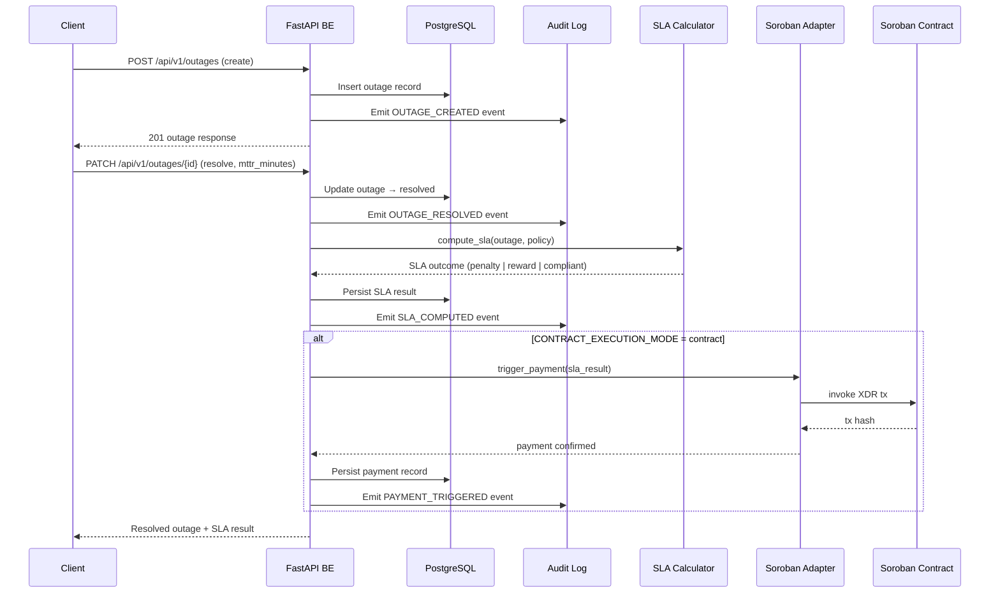
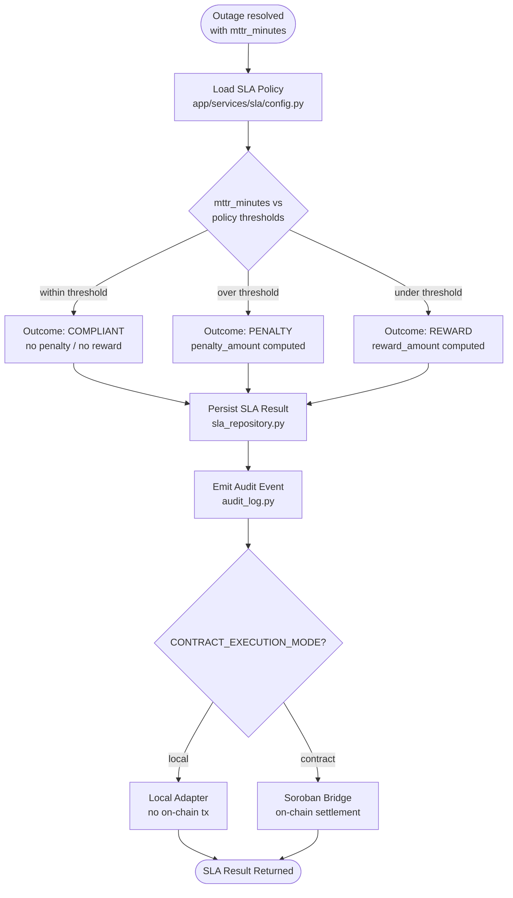
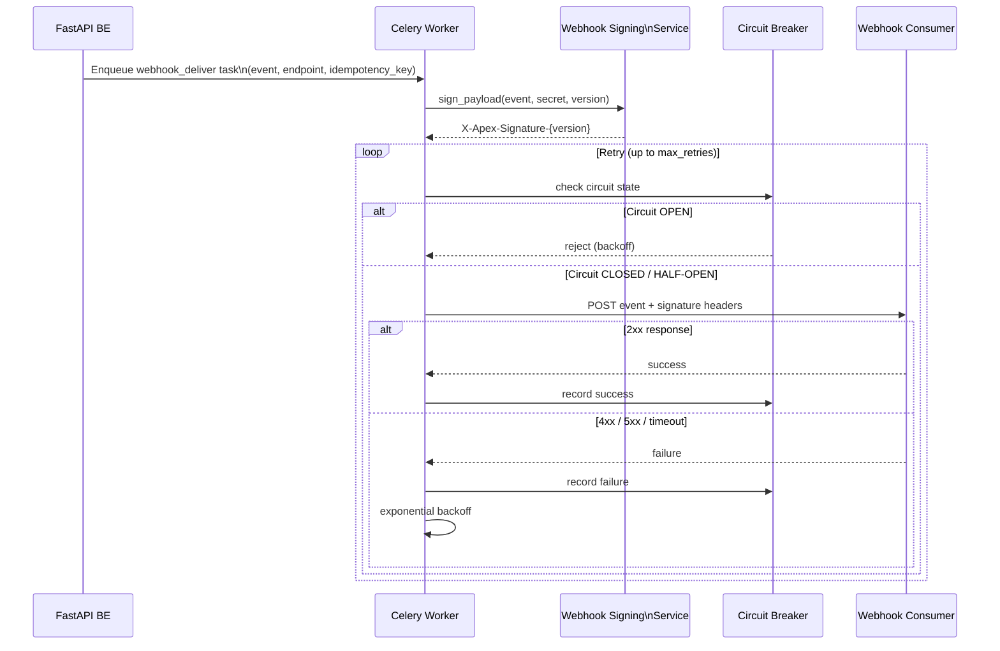
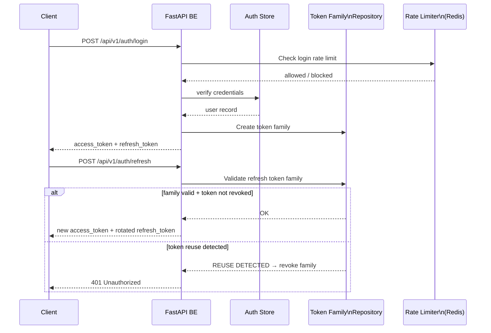
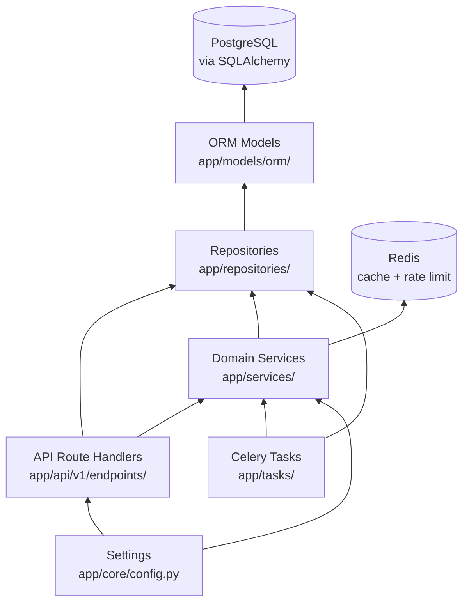

# ApexChainx Architecture Diagrams

This document contains Mermaid diagrams illustrating the architecture, key data flows, and subsystem interactions of the ApexChainx backend.

---

## 1. System Overview

High-level view of the three-repo monorepo and how traffic flows through the system.

> The frontend **never** calls contracts directly. All Soroban interactions are brokered exclusively through the backend.

---

## 2. Request Routing and Middleware Stack

Sequence of middleware layers every inbound HTTP request passes through before reaching a route handler.

```mermaid
graph LR
    Request([Inbound Request])
    CORSMiddleware[CORS Middleware]
    SecurityHeaders[Security Headers\nMiddleware]
    CorrelationID[Correlation ID\nMiddleware]
    PayloadSize[Payload Size Guard\nMiddleware]
    ContentType[Content-Type\nMiddleware]
    ETag[ETag Middleware]
    Idempotency[Idempotency\nMiddleware]
    APIVersion[API Version\nMiddleware]
    RouteHandler[FastAPI Route Handler]

    Request --> CORSMiddleware --> SecurityHeaders --> CorrelationID --> PayloadSize
    PayloadSize --> ContentType --> ETag --> Idempotency --> APIVersion --> RouteHandler
```

---

## 3. Outage and SLA Lifecycle

Step-by-step flow from outage creation through SLA settlement on-chain.

---

## 4. SLA Computation Sub-diagram

Internal logic of the MTTR-based SLA calculator.

---

## 5. Webhook Delivery Sub-diagram

Signed, versioned webhook delivery with retry logic and circuit-breaker protection.

---

## 6. Authentication and Token Flow

JWT-based authentication with token families and refresh token rotation.

---

## 7. Component Dependency Map

Static dependency map between the major application layers.

---

*Diagrams render natively in GitHub Markdown. Use [mermaid.live](https://mermaid.live) for local preview.*
